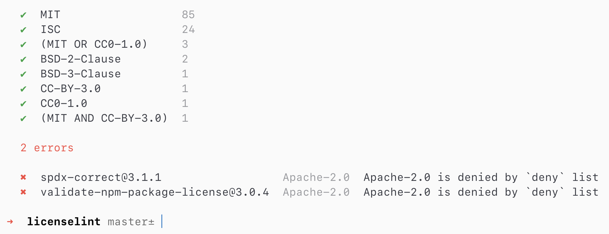

# License Lint

A linter for NPM package licenses to avoid dependencies that not compatible with license of your software. It can check licenses automatically on CI or on NPM `postinstall`.



## Install

```sh
npm install -D @rambler-digital-solutions/licenselint
```

or 

```sh
yarn add -D @rambler-digital-solutions/licenselint
```

## Usage

```sh
licenselint --help

  Lint NPM package licenses

  Usage
    licenselint [dirname]

  Options
    --production    Only lint production dependencies
    --development   Only lint development dependencies
    --summary       Output a summary of the license usage
    --deny          Fail on an occurrence of the licenses of the deny list
    --allow         Fail on an occurrence of the licenses not in the allow list
    --extends       Use custom configuration file

  Examples
    licenselint
    licenselint packages/foo
    licenselint --production
    licenselint --deny LGPL
    licenselint --allow MIT --allow ISC
    licenselint --extends shared/licenserc.json
```

## Configuration

Create `.licenserc.json` configuration file:

```json
{
  "production": true,
  "deny": [
    "GPL",
    "LGPL"
  ]
}
```

Configuration file supports all CLI flags.

Also you can extends your local setup with shared configuration:

```json
{
  "extends": "@shared/licenserc",
  "summary": true
}
```

## License

MIT
